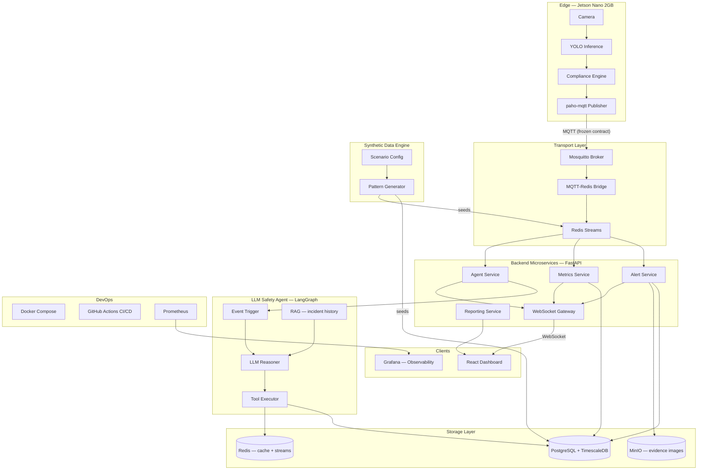
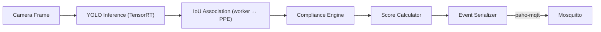
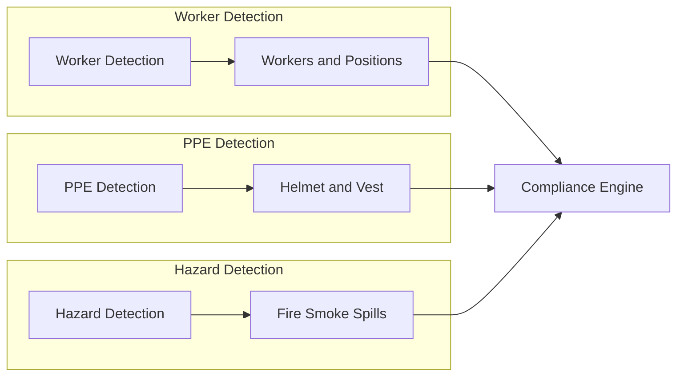
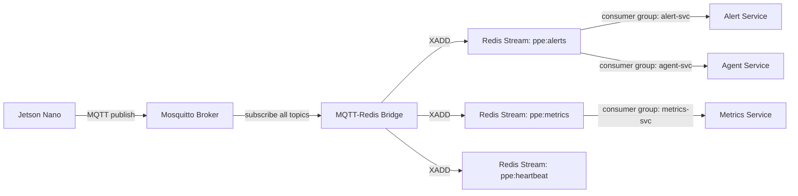
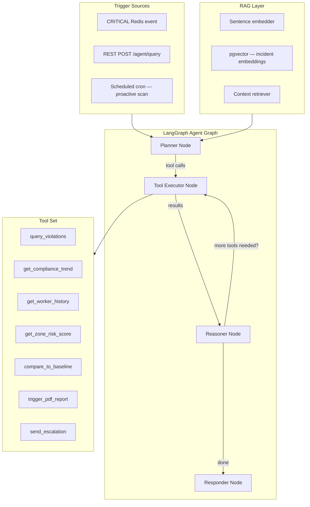
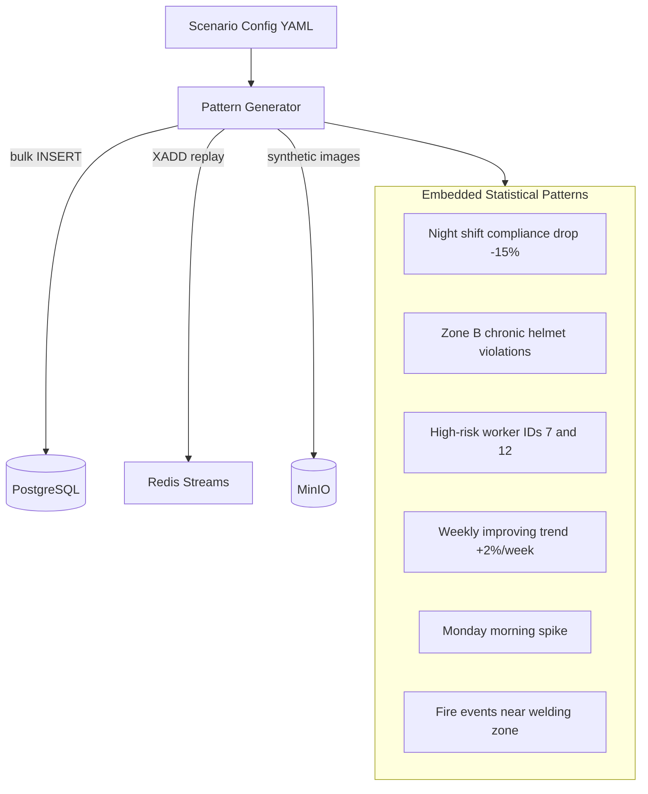
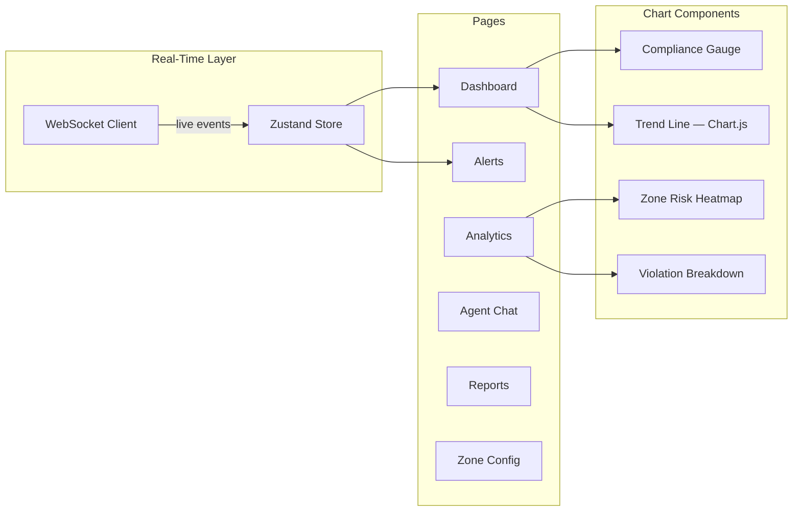
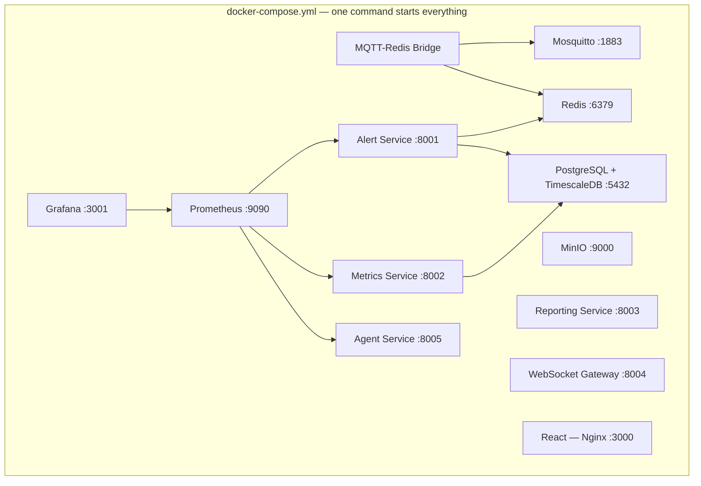
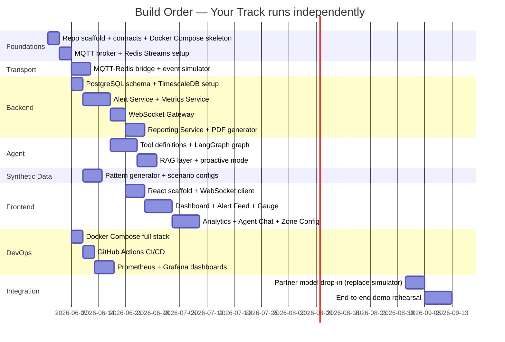

# Industrial Safety Intelligence Platform — Domain Plan

## System Philosophy

> CV is one sensor. The platform is the project.

The frozen event contract between the edge node and everything downstream is the architectural keystone. Past that contract, every domain is open for ambitious engineering.

---

## Full System Architecture



---

## Domain 1 — Edge Perception (Partner, Frozen Contract)

**Owner:** Partner. **Your involvement:** Define the contract, nothing else.

The Jetson Nano runs inference and publishes one JSON payload per detection cycle. This is the only thing your partner builds. Freeze this contract on day one and never revisit it.

### Frozen Event Contract

```python
# contracts/events.py  — shared schema, never changes
{
  "type": "alert" | "metrics" | "heartbeat",
  "event": "helmet_missing" | "vest_missing" | "fire" | "smoke" | "spill" | "compliant",
  "priority": "CRITICAL" | "HIGH" | "MEDIUM" | "LOW",
  "timestamp": "ISO8601",
  "session_id": "uuid",
  "worker_id": 7,
  "zone": "welding_bay" | "general" | "chemical_storage",
  "confidence": 0.92,
  "compliance_score": 78,
  "detections": [{"class": "helmet", "bbox": [x,y,w,h], "confidence": 0.94}],
  "image_path": "evidence/session_id/frame_001.jpg"
}
```

### Edge Internal Flow



**Compliance Engine** (Python, pure geometry — optionally yours to own):
- IoU-based PPE-to-worker association (helmet & vest → worker)
- Per-zone PPE requirement rules (helmet + vest required per supervisor)
- Rolling compliance score (5-frame window)
- Violation debounce (don't fire 30 alerts for one missing helmet)

### Supervisor-Approved Detection Classes

> Full spec: `finalization/DETECTION_CLASS_SCOPE.md`

| Track | Classes | Status |
|-------|---------|--------|
| **Worker Detection** | `worker` | Required |
| **PPE Detection** | `helmet`, `vest` | Required |
| **PPE Detection** | `gloves`, `boots` | Optional stretch — only if easy to detect |
| **Hazard Detection** | `fire`, `smoke`, `spill` | Required |

**Out of scope:** goggles, forklift, and any class not listed above.




## Domain 2 — Event Transport Layer

**Owner:** You. This is where event-driven architecture begins.



### Why Redis Streams over plain MQTT subscribers

- **Persistence:** events survive service restarts, can be replayed
- **Consumer groups:** alert-svc and agent-svc both consume the same alert stream independently — no coupling
- **Backpressure:** services process at their own pace
- **Exactly-once delivery:** acknowledgement per message (`XACK`)
- **Time-windowed queries:** `XRANGE ppe:alerts - + COUNT 100` for last N events

### MQTT Topic Structure

```
ppe/alerts/{zone}/{priority}    →  ppe:alerts stream
ppe/metrics/{session_id}        →  ppe:metrics stream
ppe/heartbeat/{device_id}       →  ppe:heartbeat stream
```

### Bridge (`transport/mqtt_redis_bridge/bridge.py`)

Async Python service:
- Subscribes to `ppe/#` wildcard
- Routes by topic prefix to correct Redis stream
- Adds `device_id`, `received_at`, `stream_sequence` metadata
- Dead-letter queue on parse failure
- Reconnect with exponential backoff

---

## Domain 3 — Backend Microservices (FastAPI)

**Owner:** You. Core of the platform.

```mermaid
flowchart TD
    subgraph alertSvc [Alert Service — :8001]
        ac1[Redis Stream Consumer]
        ac2[Deduplication — Redis TTL]
        ac3[Priority Router]
        ac4[DB Writer]
        ac5[Evidence Fetcher]
        ac1 --> ac2 --> ac3 --> ac4
        ac3 --> ac5
    end

    subgraph metricsSvc [Metrics Service — :8002]
        mc1[Stream Consumer]
        mc2["TimescaleDB Writer (hypertable)"]
        mc3[Rolling Aggregator]
        mc4[Zone Risk Scorer]
        mc1 --> mc2
        mc1 --> mc3 --> mc4
    end

    subgraph reportSvc [Reporting Service — :8003]
        rc1[REST endpoint]
        rc2[Query Builder]
        rc3[ReportLab PDF Generator]
        rc4[Scheduled Cron]
        rc1 --> rc2 --> rc3
        rc4 --> rc2
    end

    subgraph wsSvc [WebSocket Gateway — :8004]
        wc1[Redis Pub/Sub subscriber]
        wc2[Connection Manager]
        wc3[WebSocket broadcaster]
        wc1 --> wc2 --> wc3
    end

    subgraph agentSvc [Agent Service — :8005]
        asc1[CRITICAL event trigger]
        asc2[LangGraph invocation]
        asc3[Result broadcaster]
        asc1 --> asc2 --> asc3
    end
```



### REST API Surface

```
GET  /api/alerts?zone=&priority=&from=&to=&limit=
GET  /api/alerts/{id}
GET  /api/metrics/compliance?zone=&shift=&days=
GET  /api/metrics/trend?granularity=1h|1d|1w
GET  /api/metrics/zone-risk
GET  /api/workers/{id}/history
GET  /api/reports?type=shift|daily|weekly
POST /api/reports/generate
GET  /api/agent/insights
POST /api/agent/query        ← conversational endpoint
GET  /api/health
```

### PostgreSQL Schema (key tables)

```sql
-- TimescaleDB hypertable — time-series compliance
CREATE TABLE compliance_metrics (
    time        TIMESTAMPTZ NOT NULL,
    zone        TEXT,
    shift       TEXT,
    score       FLOAT,
    worker_count INT,
    violation_count INT
);
SELECT create_hypertable('compliance_metrics', 'time');

-- Violations / alerts log
CREATE TABLE violations (
    id          UUID PRIMARY KEY,
    timestamp   TIMESTAMPTZ,
    worker_id   INT,
    zone        TEXT,
    event_type  TEXT,
    priority    TEXT,
    confidence  FLOAT,
    image_path  TEXT,
    acknowledged BOOLEAN DEFAULT FALSE,
    agent_briefing TEXT   -- populated by LLM agent
);

-- Zone configuration (rule engine) — supervisor scope
CREATE TABLE zone_rules (
    zone        TEXT PRIMARY KEY,
    requires_helmet  BOOLEAN,
    requires_vest    BOOLEAN,
    requires_gloves  BOOLEAN DEFAULT FALSE,  -- optional stretch
    requires_boots   BOOLEAN DEFAULT FALSE   -- optional stretch
);
```

---

## Domain 4 — LLM Safety Agent (LangGraph)

**Owner:** You. This is the differentiator.



### Three Agent Modes

**Reactive** (triggered by CRITICAL stream event):
> Input: raw alert JSON
> Agent queries worker history, zone risk, recent trend
> Output: 2-3 sentence contextual briefing pushed to dashboard alongside the alert

**Conversational** (triggered by dashboard chat input):
> "Which zone is most dangerous this week?"
> Agent calls `get_zone_risk_score` + `get_compliance_trend`, reasons, responds

**Proactive** (runs every 4 hours):
> Scans for anomalies: unusual violation clusters, declining trends, high-risk workers
> Surfaces unprompted insights to dashboard "Insights" panel

### Agent Tool Implementation

Each tool is a thin async wrapper over your own FastAPI/DB:

```python
# agent/tools/query_violations.py
async def query_violations(zone: str, hours: int, ppe_type: str) -> list[dict]:
    """Query recent violations — agent calls this to investigate."""
    return await db.fetch(
        "SELECT * FROM violations WHERE zone=$1 AND timestamp > NOW() - INTERVAL '$2 hours'",
        zone, hours
    )
```

Tools are pure Python functions — no extra infrastructure, no cost. The LLM just calls them.

### LLM Choice

- **Primary:** OpenAI GPT-4o via API (reliable function calling)
- **Fallback / offline:** Ollama + Llama 3.1 8B (fully local, no cost, works without internet — good for demo resilience)

---

## Domain 5 — Synthetic Data Engine

**Owner:** You. Solves the data bootstrapping problem and is a first-class deliverable.



### Scenario Configuration

```yaml
# synthetic/scenarios/90day_baseline.yaml
duration_days: 90
workers: 15
zones:
  - welding_bay
  - general_floor
  - chemical_storage
baseline_compliance: 0.82
patterns:
  night_shift_drop: 0.15
  chronic_zones: [welding_bay]
  high_risk_workers: [7, 12]
  weekly_improvement: 0.02
  events_per_hour: 45
  critical_events_per_day: 2
```

Running `python synthetic/generate.py --scenario 90day_baseline` seeds the entire database. The agent, analytics, and dashboard immediately have 90 days of rich history.

---

## Domain 6 — Frontend (React + Vite)

**Owner:** You.



### Key Components

- **Compliance Gauge** — live percentage, animates on each WebSocket event
- **Alert Feed** — chronological, colour-coded by priority, with agent briefing inline
- **Agent Chat Panel** — text input → POST `/api/agent/query` → streamed response
- **Analytics Page** — compliance trend (1h/1d/1w/1m), zone risk heatmap, violation breakdown pie, shift comparison
- **Zone Config UI** — edit per-zone PPE rules (updates `zone_rules` table in real time)
- **Report Generator** — date range picker → PDF download

---

## Domain 7 — DevOps (Docker Compose + CI/CD + Observability)

**Owner:** You. This alone sets you apart from every other team.

### Service Topology



### GitHub Actions CI/CD

```
on: push to main / PR
jobs:
  lint → pytest (unit) → pytest (integration, docker-compose up) → build images → push to registry
```

### Observability (Prometheus + Grafana)

Two Grafana dashboards:
- **System Health:** events/sec through Redis, service latency, DB query time, agent invocations, error rates
- **Safety KPIs:** live compliance score, violation rate, zone breakdown, alert resolution time

Seeing both dashboards simultaneously in the demo says "production-grade" without any words.

---

## Repository Structure

```
smart-surveillance/
├── contracts/               # Frozen event schema (shared)
│   └── events.py
├── edge/                    # Partner's domain
│   ├── inference/
│   ├── compliance_engine/
│   └── mqtt_publisher/
├── transport/
│   └── mqtt_redis_bridge/
├── services/
│   ├── alert_service/
│   ├── metrics_service/
│   ├── reporting_service/
│   ├── websocket_gateway/
│   └── agent_service/
├── agent/
│   ├── tools/
│   ├── graph/
│   └── rag/
├── synthetic/
│   ├── scenarios/
│   └── generator.py
├── frontend/
│   └── src/
├── infra/
│   ├── docker-compose.yml
│   ├── prometheus/
│   ├── grafana/
│   └── .github/workflows/
└── contracts/
    └── events.py
```

---

## Build Sequence (Decoupled from Partner)



Partner integration happens **once, late, as a config swap** — the simulator keeps everything runnable until that point.

---

## Demo Script (the money shot, 12 minutes)

1. `docker compose up` — entire stack starts live on screen (1 min)
2. Open Grafana — show system health: events/sec, service health (1 min)
3. Live demo: take off helmet → alert fires → gauge drops → agent briefing appears on dashboard alongside alert (2 min)
4. Open Agent Chat: *"Which zone is highest risk this week?"* — agent reasons, answers with data (2 min)
5. Analytics page: 90-day compliance trend, zone heatmap, worker risk ranking (2 min)
6. Click Generate Report → PDF downloads with org header, charts, recommendations (1 min)
7. Open Zone Config → change welding bay rule live → system enforces immediately (1 min)
8. Q&A — architecture diagram on screen (2 min)
